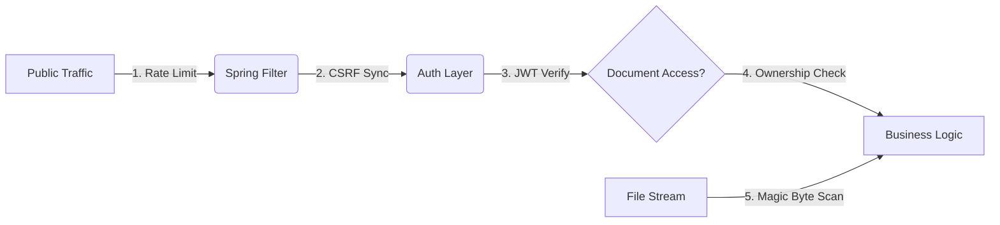

# 🖋️ Ala-Too Digital Signature Platform (Noir Edition)


[](https://github.com/mars0894/digital-sign-ALA-TOO-/blob/Noir.version/security_audit_report.md)
[](https://github.com/mars0894/digital-sign-ALA-TOO-/tree/Noir.version)

Welcome to the **Noir Edition**—a mission-critical transformation of the Ala-Too Digital Signature ecosystem. This edition is not just a branch; it is an architectural commitment to **Zero-Trust Security** and **Seamless Teamwork**.

---

## 🚀 Experience the "Noir" Difference

````carousel
### 🛡️ Ironclad Security
**Everything is gated.**
- **HttpOnly Cookies:** Session tokens are invisible to hackers.
- **BOLA Protection:** Ownership is verified on every single byte of data.
- **Magic Byte Scanning:** We verify the "DNA" of every file you upload.
<!-- slide -->
### 👥 Team Collaboration
**Work together, faster.**
- **Collaborators Mode:** Invite teammates with granular roles (Viewer, Editor, Manager).
- **Real-Time Sync:** See cursors move and signatures appear instantly across the university.
- **Live Notifications:** Never miss a request or a share.
<!-- slide -->
### 🎨 Premium UI/UX
**Built for the future.**
- **Glassmorphism Design:** A sleek, modern dashboard inspired by modern institutional aesthetics.
- **Responsive Flows:** Manage signatures from your phone, tablet, or desktop with 100% parity.
- **Animated PDF Workspace:** A living, breathing canvas for your most important documents.
````

---

## 🏛️ The Noir Privilege: Architectural Superiority

Compared to the foundational version (main), the **Noir Edition** provides a significantly more professional and resilient infrastructure. Here is why Noir is the institutional standard for **Ala-Too International University**.

### 1. 🛡️ The Session Privilege (Anti-XSS Architecture)
In the standard version, identity tokens are stored in `localStorage`. This makes them vulnerable to **Cross-Site Scripting (XSS)**—if a hacker injects a single line of JS, your session is gone.
- **Noir Advantage:** We use **HttpOnly** cookies that are physically inaccessible to JavaScript. Even if an attacker finds an injection point, they *cannot* steal your identity. Your session belongs to the browser, not the script.

### 2. 📂 The File Integrity Privilege (Deep-Stream Scanning)
Foundational systems trust the file extension (e.g., `.pdf`). A sophisticated attacker can rename a malicious script to `.pdf` and bypass simple filters.
- **Noir Advantage:** We integrated **Apache Tika**. Every file you upload is opened at the binary level. We verify the actual "Magic Bytes" of the hardware signature. If the code says it's a script but the name says it's a PDF, Noir kills the upload instantly.

### 3. 👥 The Collaborative Privilege (Live Workspaces)
Standard document tools are isolated. You upload, you sign, you download.
- **Noir Advantage:** Transition from a "Document tool" to a **"Digital Headquarters"**. With **STOMP WebSockets**, your team can work on the same document simultaneously. Cursors, signature placements, and comments are synchronized in milliseconds, eliminating the "email-ping-pong" of traditional signing.

### 4. ⚡ The Resilience Privilege (DoS Defenses)
Public portals are prime targets for **Denial of Service** attacks. A user could upload a 500MB "zip bomb" to crash the server memory.
- **Noir Advantage:** Noir implements a strict **20MB Tomcat buffer** and **30-second execution timeouts** on the Gotenberg conversion engine. The system is designed to sever hostile connections automatically to preserve the core university infrastructure.

---

## 🔒 Security Showcase: The "Noir Guard"


The **Noir Edition** implements a multi-layered defense strategy to protect institutional data.

> [!IMPORTANT]
> **Why we are the most secure branch:**
> 1. **SQLi Defense:** Automated JPA parameterization.
> 2. **XSS Neutralization:** Next.js sanitization + Non-Scriptable Cookies.
> 3. **DoS Shielding:** 20MB Hard Caps & Request Execution Timeouts.

### 🛡️ The Defensive Perimeter


---

## ⚙️ Technical Architecture

- **Backend:** Java 21, Spring Boot 3.3, Flyway (RDBMS Migrations).
- **Frontend:** Next.js 16, TailwindCSS, Framer Motion (Animations).
- **Security:** Apache Tika (MIME), Bucket4j (Rate Limiting).
- **Conversion:** Gotenberg (Isolated LibreOffice containers).

---
**Developed for Ala-Too International University | 2026**
