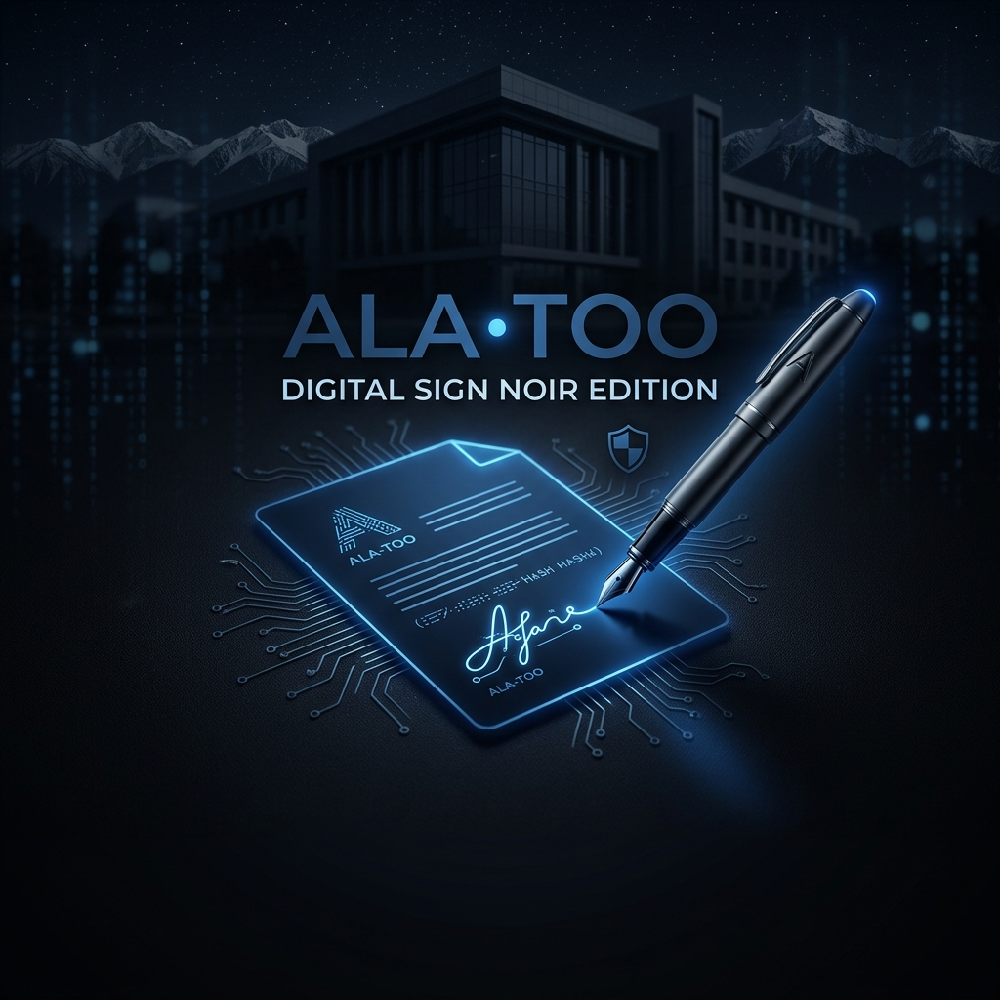
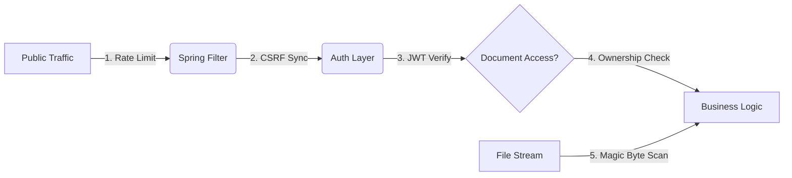

# 🖋️ Ala-Too Digital Signature Platform (Noir Edition)



[](https://github.com/mars0894/digital-sign-ALA-TOO-/blob/Noir.version/security_audit_report.md)
[](https://github.com/mars0894/digital-sign-ALA-TOO-/tree/Noir.version)

Welcome to the **Noir Edition**—a mission-critical transformation of the Ala-Too Digital Signature ecosystem. This edition is not just a branch; it is an architectural commitment to **Zero-Trust Security** and **Seamless Teamwork**.

---

## 🚀 Experience the "Noir" Difference

````carousel
### 🛡️ Ironclad Security
**Everything is gated.**
- **HttpOnly Cookies:** Session tokens are invisible to hackers.
- **BOLA Protection:** Ownership is verified on every single byte of data.
- **Magic Byte Scanning:** We verify the "DNA" of every file you upload.
<!-- slide -->
### 👥 Team Collaboration
**Work together, faster.**
- **Collaborators Mode:** Invite teammates with granular roles (Viewer, Editor, Manager).
- **Real-Time Sync:** See cursors move and signatures appear instantly across the university.
- **Live Notifications:** Never miss a request or a share.
<!-- slide -->
### 🎨 Premium UI/UX
**Built for the future.**
- **Glassmorphism Design:** A sleek, modern dashboard inspired by modern institutional aesthetics.
- **Responsive Flows:** Manage signatures from your phone, tablet, or desktop with 100% parity.
- **Animated PDF Workspace:** A living, breathing canvas for your most important documents.
````

---

## 🔒 Security Showcase: The "Noir Guard"


The **Noir Edition** implements a multi-layered defense strategy to protect institutional data.

> [!IMPORTANT]
> **Why we are the most secure branch:**
> 1. **SQLi Defense:** Automated JPA parameterization.
> 2. **XSS Neutralization:** Next.js sanitization + Non-Scriptable Cookies.
> 3. **DoS Shielding:** 20MB Hard Caps & Request Execution Timeouts.

### 🛡️ The Defensive Perimeter


---

## 👥 Deep-Dive: Collaborators Mode

In the **Noir Edition**, documents are never silos. Transitioning from **"My Files"** to **"Our Workspace"**:

| Feature | Description |
| :--- | :--- |
| **Granular Roles** | Assign `OWNER`, `EDITOR`, or `VIEWER` to any collaborator. |
| **WebSocket Sync** | Every signature placement is broadcast in <50ms. |
| **Live Presence** | See exactly who is viewing the document in real-time. |
| **Secure Sharing** | Obfuscated links and temporary access tokens for downloads. |

---

## ⚙️ Technical Architecture

- **Backend:** Java 21, Spring Boot 3.3, Flyway (RDBMS Migrations).
- **Frontend:** Next.js 16, TailwindCSS, Framer Motion (Animations).
- **Security:** Apache Tika (MIME), Bucket4j (Rate Limiting).
- **Conversion:** Gotenberg (Isolated LibreOffice containers).

---
**Developed for Ala-Too International University | 2026**
